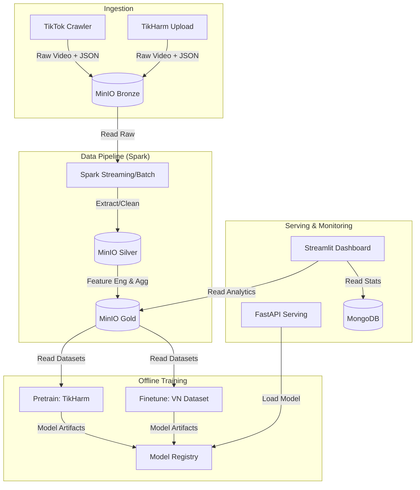

# System Architecture

This document describes the high-level architecture of the **TikTok Harmful Content Detection** system. The system involves a detailed data pipeline from ingestion to model serving, leveraging a Medallion architecture (Bronze/Silver/Gold) on MinIO.

## 1. High-Level Data Flow

## 2. Data Ingestion

### Source 1: TikTok Crawler
- **Path**: `data-ingestion/tiktok_crawl`
- **Tool**: Playwright + `yt_dlp`
- **Flow**:
  1. Scrapes videos by hashtag or user.
  2. Extracts metadata (likes, comments, description, tags).
  3. Downloads video files.
  4. Uploads to **MinIO Bronze** bucket (`tiktok-data/bronze/{video_id}/`).

### Source 2: TikHarm Dataset
- **Path**: `data-ingestion/tikharm_upload`
- **Tool**: Python script.
- **Flow**:
  1. Reads local TikHarm dataset (Adult, Harmful, Safe, Suicide).
  2. Uploads to **MinIO Bronze** bucket with standard layout.

## 3. Medallion Architecture (MinIO)

Data is organized into three layers in MinIO (`tiktok-data` bucket):

### Bronze Layer (`bronze/`)
**Raw, immutable data.**
- Structure: `bronze/{video_id}/`
- Content:
  - `video.mp4`: Original downloaded video.
  - `metadata.json`: Raw metadata from TikTok/TikHarm.

### Silver Layer (`silver/`)
**Cleaned, enriched, enriched data.**
- Processed by: `offline_training.preprocessing` pipelines or Spark jobs.
- Structure: `silver/{video_id}/`
- Content:
  - `audio.wav`: Extracted 16kHz mono audio.
  - `frames/`: Extracted video frames (resized to 224x224).
  - `video_embedding.npy`: TimeSformer embeddings.
  - `audio_embedding.npy`: Wav2Vec2 embeddings.
  - `metadata_features.npz`: Processed text features (BERT/TF-IDF on comments/captions).

### Gold Layer (`gold/`)
**Business-level, ML-ready datasets.**
- Structure: `gold/`
- Content:
  - `tikharm_local_multimodal.npz`: Aggregated features for training TikHarm model.
  - `vn_safe_notsafe.parquet`: Dataset for finetuning on Vietnamese context.
  - `analytics_views/`: Aggregated stats for Dashboard.

## 4. Offline Training

### Pretraining
- **Script**: `offline_training/pretrain/train_tikharm.py`
- **Goal**: Train a 4-class classifier (Adult, Harmful, Safe, Suicide) on the TikHarm dataset.
- **Inputs**: Multimodal features from `gold/`.

### Finetuning
- **Script**: `offline_training/finetune/train_tiktok_vn.py`
- **Goal**: Finetune the pretrained model on specific Vietnamese TikTok data (Safe / Not Safe).

## 5. Serving & Dashboard

### Model Serving
- **Path**: `model-serving/`
- **Tech**: FastAPI + Torch.
- **Function**: Exposes HTTP endpoints to predict safety score for a given video ID (fetching features from Silver/Gold).

### Dashboard
- **Path**: `dashboard/`
- **Tech**: Streamlit.
- **Features**:
  - Real-time monitoring of ingested videos.
  - Visualization of "Not Safe" content statistics.
  - Manual review interface.
